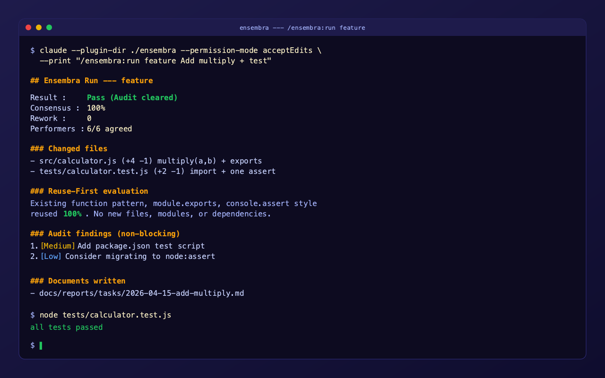
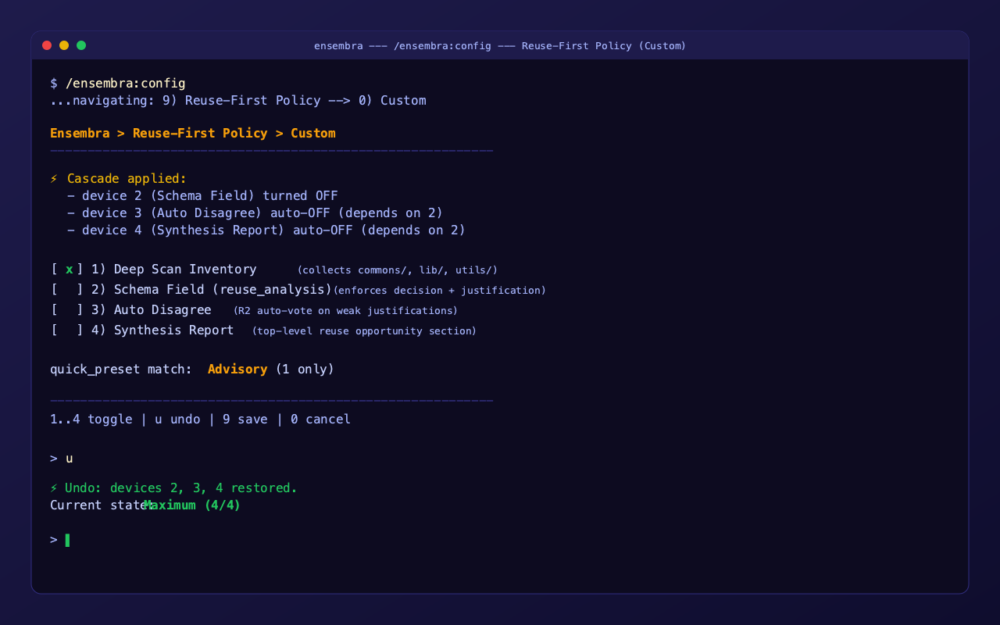
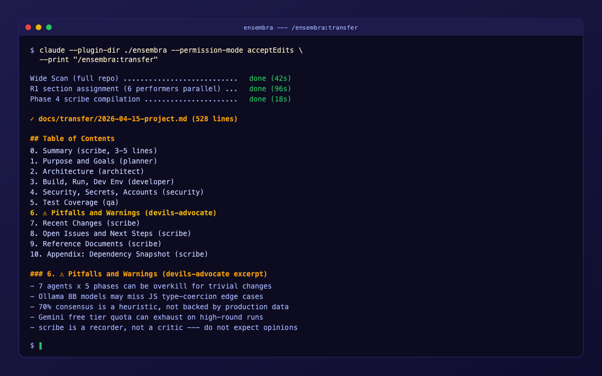

<p align="center">
  
</p>

<h1 align="center">Ensembra</h1>

<p align="center">
  <em>Where agents perform in concert — a multi-agent orchestrator plugin for Claude Code.</em>
</p>

<p align="center">
  <a href="https://github.com/HotRedMat/ensembra/releases"></a>
  <a href="./LICENSE"></a>
  
  
</p>

## Screenshots

<table>
  <tr>
    <td align="center">
      <br/>
      <sub><code>/ensembra:run feature</code> — 5-phase pipeline with consensus and reuse evaluation</sub>
    </td>
    <td align="center">
      <br/>
      <sub><code>/ensembra:config</code> — interactive picker with cascade-safe custom mode</sub>
    </td>
  </tr>
  <tr>
    <td align="center" colspan="2">
      <br/>
      <sub><code>/ensembra:transfer</code> — 10-section handover document with devils-advocate pitfalls</sub>
    </td>
  </tr>
</table>

## What is Ensembra?

Ensembra is a Claude Code plugin that orchestrates **six specialist agents** and **one scribe** through a **5-phase pipeline** to produce structured code reviews, mutual supervision, automatic documentation, and project handover documents. Built for solo developers who want team-level deliberation without the team.

**Key ideas**:
- **Separation of deliberation and execution**: external LLMs (Ollama / Gemini) debate, Claude Code executes.
- **Reuse-First cross-cutting policy**: four toggleable devices force every performer to consider existing code before writing new code.
- **Deep Source Inspection**: 10-item checklist (6 forced + 4 optional) prevents shallow reads.
- **Consensus-driven flow**: 70/40 thresholds gate Phase 2 execution and halt pipeline on strong disagreement.
- **Automatic documentation**: every task produces a report; weekly roll-ups and handover documents are built-in.

## 5-Phase Pipeline

```
Phase 0 Gather     — Deep Scan produces a shared context snapshot
Phase 1 Deliberate — R1 → (optional R2) → Synthesis with peer signatures
Phase 2 Execute    — Claude Code edits files per the agreed plan
Phase 3 Audit      — designated performers verify the diff
Phase 4 Document   — scribe records Task / Design / Request / Daily / Weekly
```

## Performers

| Role | Responsibility | Default Transport | Default Model |
|---|---|---|---|
| 🧭 **planner** | Requirements, acceptance criteria | Claude sub-agent | `opus` |
| 🏛 **architect** | Module boundaries, patterns | Gemini | `gemini-2.5-flash` |
| 🛠 **developer** | Implementation strategy | Claude sub-agent | `sonnet` |
| 🛡 **security** | Threats, secrets, OWASP | Ollama | `qwen2.5:14b` |
| 🧪 **qa** | Edge cases, regression | Ollama | `llama3.1:8b` |
| 😈 **devils-advocate** | Counter-arguments, YAGNI | Claude sub-agent | `haiku` |
| ✍️ **scribe** | Phase 4 documentation | Claude sub-agent | `sonnet` |

All models auto-fall back to Claude sub-agents when the external transport is unavailable.

## Skills

- `/ensembra:run <preset> <request>` — main pipeline entry point
- `/ensembra:config` — unified interactive settings picker (all options, all cascade-safe)
- `/ensembra:transfer [scope]` — project handover document (full project, path, or natural-language scope)
- `/ensembra:report daily|weekly` — roll-up reports

## Presets

| Preset | Performers | Rounds | Phase 2 | Phase 3 Audit | Phase 4 |
|---|---|---|---|---|---|
| `feature` | all 6 | R1→R2→Syn | on | all 6 | Task+Design+Request |
| `bugfix` | planner+architect+developer+qa | R1→Syn | on | qa+security | Task |
| `refactor` | architect+developer+devils+qa | R1→R2→Syn | on | architect+devils | Task+Design+Request |
| `security-audit` | security+devils+architect | R1→Syn | off | — | Task |
| `source-analysis` | architect+security+developer | R1→Syn | off | — | Task |
| `transfer` | all 6 + scribe | R1 only | off | off | handover doc |

## Installation

### Option A — Load directly for testing

```bash
cd /path/to/your/project
claude --plugin-dir /path/to/ensembra
```

### Option B — Install via marketplace

```bash
claude plugin marketplace add HotRedMat/ensembra
claude plugin install ensembra@ensembra
```

### Ollama setup (optional, for security/qa)

```bash
ollama pull qwen2.5:14b llama3.1:8b
```

### Gemini setup (optional, for architect)

Ensembra v0.5.0 uses Claude Code's native `userConfig` with `sensitive: true`. The key is stored in your OS keychain and accessed via `${user_config.gemini_api_key}` template substitution in the plugin's skills and agents. No workaround paths, no plaintext files.

Set the key via the Claude Code plugin UI:

```
/plugin
```

Then:
1. Move the cursor down to `ensembra`
2. Press **Enter** to open the plugin detail view
3. Select **"Configure options"**
4. Enter the key in the `gemini_api_key` field — it's declared `sensitive: true` so input is masked and the value is saved to your OS keychain (macOS Keychain, or `~/.claude/.credentials.json` on other platforms), never to `settings.json`
5. Save
6. `/reload-plugins`

**Get a free API key** at <https://aistudio.google.com/app/apikey>. Default model is `gemini-2.5-flash`.

**Leave it unset if you don't want Gemini** — the architect performer falls back to a Claude sub-agent automatically. Ensembra works fully without a key.

**Storage**: Claude Code uses the OS-native secret store. On macOS that's Keychain; on Linux it's Secret Service (gnome-keyring / kwallet) or `~/.claude/.credentials.json`. The plaintext key never touches any file you would accidentally share.

**Get a free API key** at <https://aistudio.google.com/app/apikey>. Default model is `gemini-2.5-flash`.

**Leave it unset if you don't want Gemini** — the architect performer will fall back to a Claude sub-agent automatically. No Gemini account required to use Ensembra.

## Reuse-First Policy

Four devices, toggleable via `/ensembra:config → Reuse-First Policy`:

1. **Deep Scan Inventory** — Phase 0 collects all reusable symbols from `commons/`, `shared/`, `lib/`, etc.
2. **Schema Field** — every R1 output must include `reuse_analysis.decision: reuse | extend | new` with justification
3. **Auto Disagree** — R2 peers automatically disagree when `new` decisions have weak justification (regex-matched)
4. **Synthesis Report** — a fixed top-level section reports missed reuse opportunities

Quick Select: **Maximum** (default) / Strong / Balanced / Advisory / Off. Custom mode uses cascade rules so no invalid combination is reachable.

## Out of scope

- **Session handoff notes** (mid-work pause/resume) — use external plugins like `d2-ops-handoff`
- **ChatGPT integration** — excluded for ToS and stability reasons; use Claude/Gemini/Ollama

## Documentation

- [`CONTRACT.md`](./CONTRACT.md) — pipeline contract, schemas, Reuse-First policy (Korean)
- [`INTERVIEW.md`](./INTERVIEW.md) — design decision log (Korean)
- [`SECURITY.md`](./SECURITY.md) — threat model and secret handling (Korean)
- [`CHANGELOG.md`](./CHANGELOG.md) — version history and verification results
- [`docs/transfer/2026-04-15-project.md`](./docs/transfer/2026-04-15-project.md) — Ensembra's own handover document (generated by Ensembra itself)

## Verification status

`v0.1.0` is fully verified at the structural and behavioral level:

- `claude plugin validate` passes
- All 8 agents invoked individually in live sessions
- End-to-end runs on `feature`, `bugfix`, `refactor`, `security-audit`, `source-analysis` presets
- `transfer` generated a 528-line handover document for the Ensembra project itself
- `/ensembra:report daily|weekly` handles both populated and empty-week states
- **Rework loop** triggered twice on an intentionally-weak email validator, converging on pass with 19 tests
- **Halt-on-low-consensus** triggered on a deliberately controversial refactor request (0% consensus, pipeline stopped before Phase 2)
- **Ensembra's `source-analysis` preset caught 4 real drift bugs in Ensembra's own code** — the strongest possible proof that the plugin catches real bugs
- **All three transports verified end-to-end**: Ollama (`qwen2.5:14b`, `llama3.1:8b`), Gemini (`gemini-2.5-flash`), Claude sub-agents

See [`CHANGELOG.md`](./CHANGELOG.md) for the full verification log.

## License

MIT © 2026 Seungho Lee
